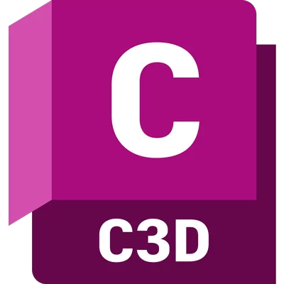

<h1 align="center">Hi , I'm Abdelrahman Galal</h1>

 
### ⚡ Here's Some Fun Facts About Me:

- 💻 I’m a student at **Information Technology Institute**

- 💬 I am capable to solve working problems.

- 🌱 My next mission is how to become a **GIS Developer**.

- 😄 Passionate about learning & development to reach the target.

- 📝 Get Details about me : [**Curriculum Vitae**](https://drive.google.com/file/d/19XjzbDVHWPyZAa4bZpZjGgYdaTFnqGTM/view?usp=sharing)

- 📫 How to reach me : **Abdelrahman.M.Galal@Gmail.com**
   

## 📫 Connect with me:

    

 
<h2 align="left">✨Languages and Tools:</h2>

 
&nbsp;
&nbsp;
&nbsp;
&nbsp;
&nbsp;
&nbsp;
&nbsp;
&nbsp;
&nbsp;
&nbsp;
&nbsp;
&nbsp;
&nbsp;
&nbsp;
&nbsp;
&nbsp;
&nbsp;
&nbsp;
&nbsp;

 
<h2 align="left">📜Certificates</h2>

<h4>
   
- <a href="https://coursera.org/share/1afadb0f63e4a7345f774f097ba8f40d">Introduction to GIS Mapping</a>

- <a href="https://maharatech.gov.eg/mod/customcert/view.php?id=7655&downloadown=1">DATABASE FUNDAMENTALS</a>
   
- <a href="https://www.credly.com/badges/202c9478-bf8d-4ba6-97f1-45520ee3c698/">SAS Visual Analytics 1 for SAS Viya: Basics</a>

- <a href="https://www.credly.com/badges/74938f7c-7a79-424e-b04f-e5c3e20d112d/">SAS Visual Analytics 2 for SAS Viya: Advanced</a>

- <a href="https://learn.mongodb.com/c/z0ANpTy-R5GseUh14PxEAQ">Introduction to MongoDB</a>
  
 - <a href="https://www.hackerrank.com/certificates/iframe/b52bd824df76">C# (Basic) Certificate</a>
  
</h4>
<!--
**Galalll/Galalll** is a ✨ _special_ ✨ repository because its `README.md` (this file) appears on your GitHub profile.

Here are some ideas to get you started:

- 🔭 I’m currently working on ...
- 🌱 I’m currently learning ...
- 👯 I’m looking to collaborate on ...
- 🤔 I’m looking for help with ...
- 💬 Ask me about ...
- 📫 How to reach me: ...
- 😄 Pronouns: ...
- ⚡ Fun fact: ...
-->
